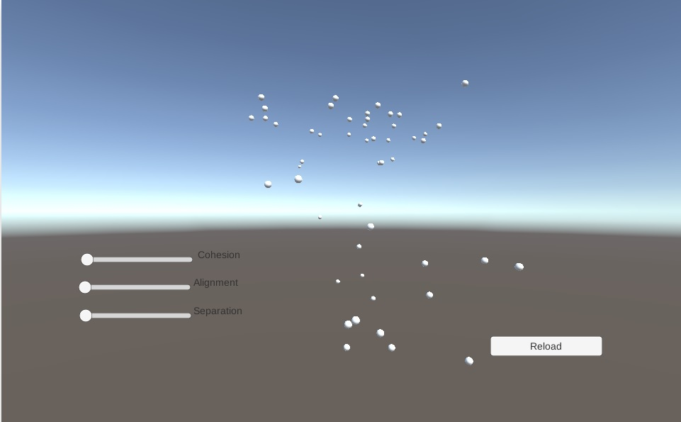

## Welcome
Hello, my name is Donte' Wilson and I've always dreamed of becoming a part of the gaming industry.I'm currently attending the Academy of Interactive Entertainment(AIE), I've currently developed skills in C++, C#, Python, and using Unity tools. I've always had a great interest in programs and how they are created. Throughout my life my main goal was to be able to develop and design games alongside a team of other developers just as passionate as I am.

##Contact
* Email: donte.wilson@students.aie.edu.au

##Skills

###Coding Skills: C++, Python, C#

###Exposed To: Visual Studio, Unity3D, Github, Trello, Design Patterns, Publisher/Subscriber, OpenGL, GLEW, GLFW

##Projects

<a href="https://dontewilson.github.io/Physics/">
<h4>Boids Simulation</h4>
</a>
